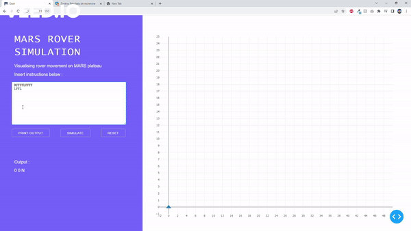

# Mars Rover Simulation

This is a little project to simulate the movement of a Mars rover. 

## Problem

A robotic rovers is to be landed by NASA on a plateau on Mars. 
This plateau, which is curiously rectangular, must be navigated by the 
rovers so that their on-board cameras can get a complete view of the 
surrounding terrain to send back to Earth.

The rover's position and location is represented by a combination of x 
and y co-ordinates and a letter representing one of the four cardinal 
compass points. The plateau is divided up into a grid to simplify 
navigation. An example position might be 0, 0, N, which means the 
rover is in the bottom left corner and facing North.

In order to control a rover, NASA sends a simple string of letters. 
The possible letters are 'L', 'R' and 'F', 'B'.

'L' and 'R' makes the rover spin 90 degrees left or right respectively
but without moving from its current spot.
'F' means move forward one grid point, and maintain the same heading.
'B' means move backward one grid point, and maintain the same heading.

Assume that the square directly North from (x, y) is (x, y+1).

### INPUT:

The rover receives lines of input.  The line is a series of instructions 
telling the rover how to explore the plateau.

### OUTPUT:

The output for each rover should be its final co-ordinates and heading.

### EXAMPLE:

##### Test Input:

    RFFFFLFFFF
    LFFL

##### Expected Output:

    4 4 N
    2 4 S

### SOLUTION :
The solution proposed is coded in Python.

The Rover.py class implements the solution for the rover. The solution also contains 
a little visualisation module based on Plotly and Dash to plot the movement of the rover
in real time for a specific set of instructions.

### REQUIREMENTS AND EXECUTION:
You'll need to install Plotly and Dash for Python.
Use the following command to automatically install the needed libraries :

    pip install -r requirements.txt

Now, you only need to execute the main.py class and access the following address on 
your favorite browser :

    http://127.0.0.1:8050/

### PREVIEW :

